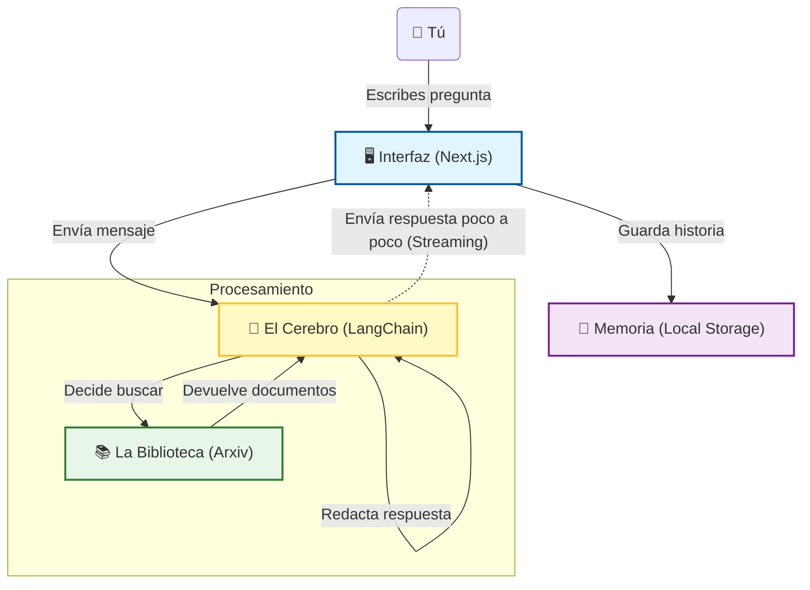

# Arquitectura del Agente de Whitepapers (Simplificada)

Este documento explica cómo funciona la aplicación "Whitepaper Agent" de una manera sencilla, para que cualquiera pueda entender qué ocurre "bajos el capó" cuando haces una pregunta. Esta solucón es solo un MVP, al implementar esta soluccion en producción se requiere una arquitectura mas robusta.

## ¿Cómo funciona?

Imagina que estás hablando con un bibliotecario muy inteligente y rápido. Aquí te explicamos quién es quién en esta conversación:

### 1. La Interfaz (Next.js)
Es la "ventanilla" donde hablas. Todo lo que ves en tu pantalla (botones, chat, textos) está construido con una tecnología llamada **Next.js**. Es la cara amable de la aplicación que recibe tus preguntas y te muestra las respuestas.

### 2. El Cerebro (LangChain)
Detrás de escena, hay un "cerebro" que procesa lo que dices. Usamos una tecnología llamada **LangChain**. Este cerebro entiende tu intención (¿qué quieres saber?) y decide qué pasos tomar para responderte. No solo repite información, sino que razona sobre ella.

### 3. La Biblioteca (Herramienta Arxiv)
El cerebro es listo, pero no lo sabe todo de memoria. Cuando necesita información científica y técnica reciente, consulta su "biblioteca" especial: **Arxiv**. Es una base de datos gigante de artículos científicos. La aplicación tiene una herramienta especial para buscar y leer estos documentos automáticamente.

### 4. La Memoria (Almacenamiento Local)
Para que no tengas que repetirle las cosas, la aplicación tiene memoria. Guarda tu historial de chat en tu propio navegador (usando algo llamado **Local Storage**). Así, si cierras la pestaña y vuelves, la conversación sigue ahí. Tus datos se quedan contigo.

### 5. La Conversación Fluida (Stream Connections)
¿Has notado que el texto aparece poco a poco, como si alguien estuviera escribiendo? Eso es gracias a las **conexiones en streaming**. En lugar de esperar a tener toda la respuesta lista (lo que tardaría mucho), el cerebro te envía cada palabra en cuanto la piensa. Así la espera se hace mucho más corta.

---

## Diagrama Visual

Aquí tienes un mapa de cómo viaja tu pregunta:

